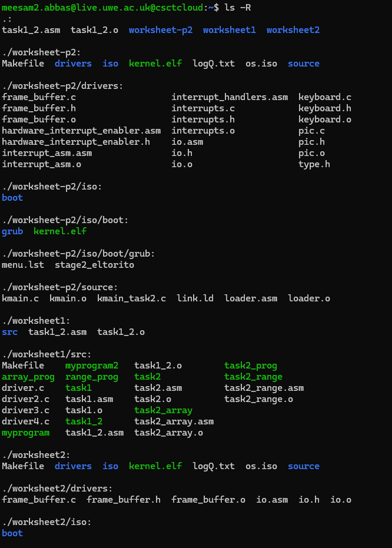
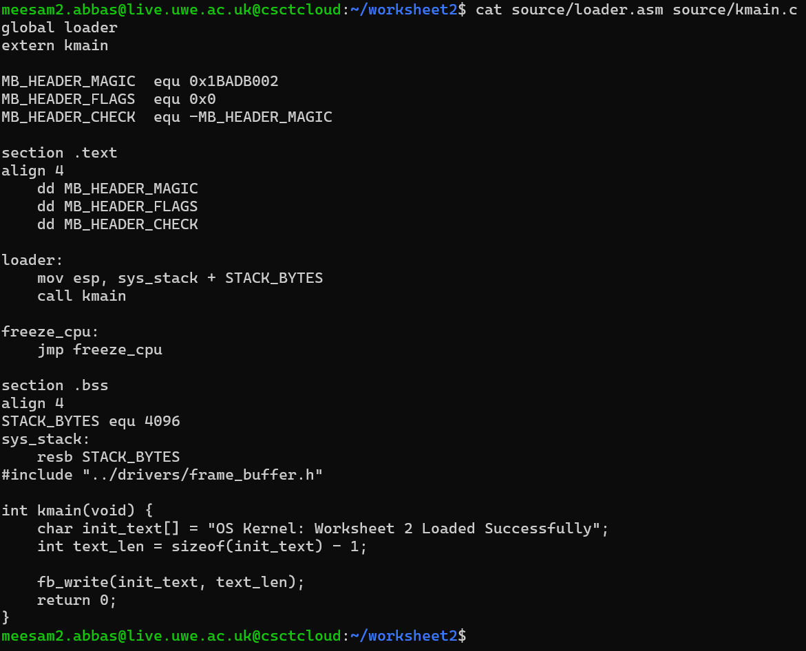
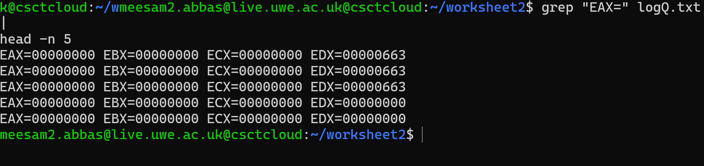
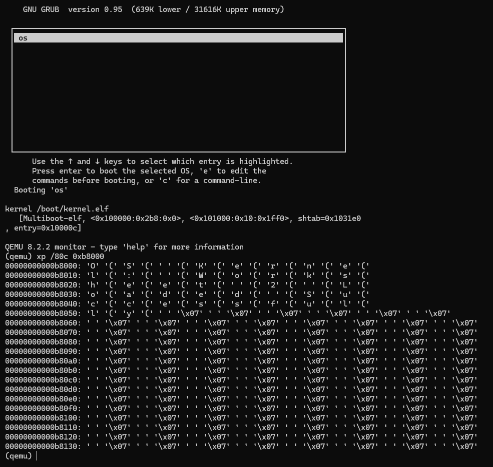

# Developing a Minimal OS Kernel (Worksheet 2 - Part 1)

This repository serves as the submission for the first half of Worksheet 2. The project focuses on bootstrapping a bare-bones Operating System kernel, establishing a boot process using GRUB, and implementing low-level drivers to interact with hardware peripherals like the Framebuffer.

## Repository Organization
To ensure maintainability, the source code is split between logic (`source`) and hardware interfaces (`drivers`), with build artifacts isolated in the `iso` folder.

**File Hierarchy:**


---

## Core Kernel Development

### 1. The Boot Sequence & C Integration
The kernel entry point is defined in `loader.asm`. This Assembly file initializes the environment by:
1.  Defining the **Multiboot Magic Number** (`0x1BADB002`) to ensure compatibility with the GRUB bootloader.
2.  Setting up a stack pointer to allow for C function calls.
3.  Transferring control to `kmain` in the C kernel.

I implemented test logic within the C kernel to perform arithmetic operations (e.g., a `sum_of_three` function) to verify that the linking process between Assembly and C was successful.

**Kernel & Loader Source Code:**


### 2. Execution Verification (Registers & Logs)
To verify the kernel state without a GUI, I utilized QEMU logs to inspect CPU registers.
* **Magic Number Check:** The register `EAX` confirms the successful load with the value `cafebabe`.
* **C Function Check:** The return value of the C function (57 decimal) appears in `EAX` as `0x39`.

**QEMU Log Evidence:**


---

## Hardware Driver Implementation

### 3. Framebuffer Driver (Memory Mapped I/O)
A primary goal of this worksheet was to create a driver capable of displaying text. This was achieved by writing directly to Video Memory at the physical address `0x000B8000`.

* **Assembly IO:** Implemented `outb` (output byte) to communicate with I/O ports, specifically for moving the hardware cursor.
* **C Logic:** Developed `frame_buffer.c` to abstract memory writing, allowing for character placement and color attribute settings (e.g., Light Green text).

**Driver Implementation Code:**


### 4. Output Verification
Since the kernel runs in a headless environment (using the `-nographic` flag), standard screen output is not visible. Verification was performed by dumping the memory contents. The dump below confirms that the string **"Welcome to My Tiny OS - Worksheet 2"** was successfully written to the video memory buffer.

**Memory Dump:**


---

## Build Instructions
The project utilizes a `Makefile` to handle the assembly (NASM), compilation (GCC), and linking processes automatically.

**Commands to Build and Run:**
```bash
# Compile and Generate ISO
make os.iso

# Run in QEMU (Headless/Log mode)
make run

# Clean build artifacts
make clean
